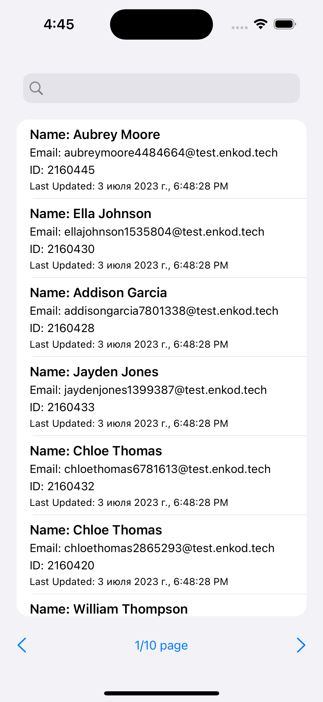
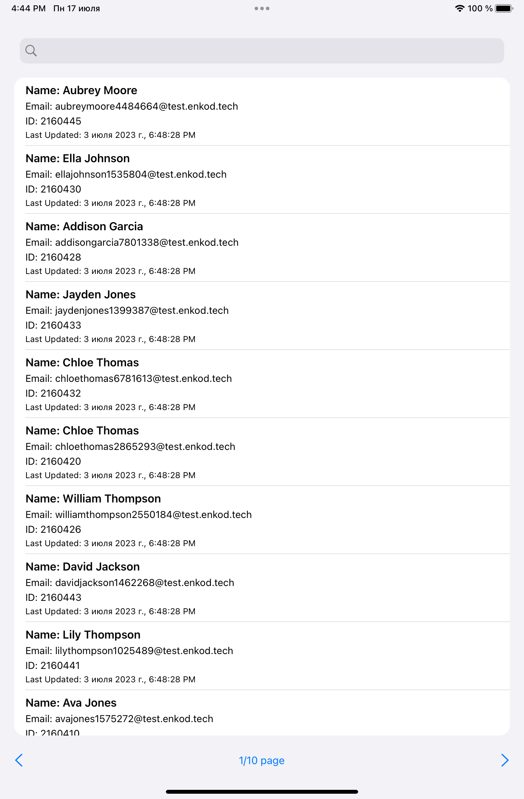

# EnkodList

EnkodList is an iOS app that fetches data from a server and displays it in a table view. It allows the user to navigate through the data using various methods, such as swiping, using a page number input, or using navigation buttons. The app also provides a search feature based on email addresses.

## Features

- Fetches data from a server
- Displays data in a table view with 10 cells per page
- Supports navigation through different pages:
  - Swipe gestures to go to the previous or next page
  - Navigation buttons for page navigation
  - Input field to enter a specific page number
- Implements search functionality based on email addresses
- Displays server date and time in the format of the device's time zone
- Supports iPad and adapts the user interface for larger screens
- Handles changes in device orientation for optimal user experience
- Offers a dark theme option for better visibility in low-light environments

## Requirements

- iOS 16.0+
- Xcode 14.3+
- Swift 5.0+

## Installation

1. Clone the repository to your local machine.
2. Open the `EnkodList.xcodeproj` file with Xcode.
3. Build and run the project on the iOS Simulator or a physical device.

## Usage

1. Launch the app on your iOS device or simulator.
2. The data will be fetched from the server and displayed in the table view.
3. Swipe down or top to navigate between pages.
4. Use the navigation buttons to go to the previous or next page.
5. Enter a page number in the input field and tap "Go" to navigate to the specified page.
6. Enter an email address in the search bar to filter the data based on the email.
7. The date and time from the server will be displayed in the format of your device's time zone.

